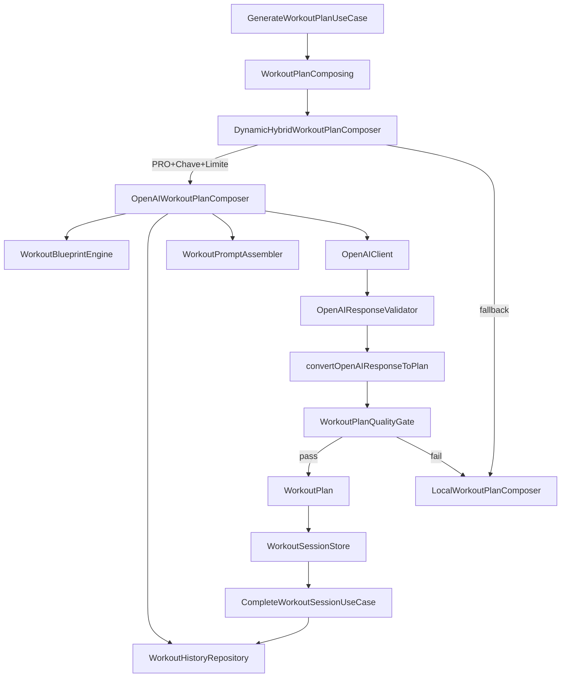

# Tech Spec — AI Workout V3 (Equalização IA + Progresso + HealthKit)

## Executive Summary

Este documento descreve como implementar a iniciativa **AI Workout V3** em 3 fases, mantendo o pipeline híbrido atual (local + OpenAI) porém **reduzindo complexidade do prompt**, reforçando **regras de segurança** e melhorando a **observabilidade** do fluxo. Em seguida, adiciona um dashboard de progresso no histórico (streak, minutos/semana e “mês em números”) e, por fim, integra **HealthKit (iPhone-only, PRO)** para importar métricas e exportar treinos como `HKWorkout`.

O código já possui bases importantes: `WorkoutBlueprintEngine`, `WorkoutPromptAssembler`, `OpenAIResponseValidator`, `WorkoutPlanQualityGate` e persistência do histórico via SwiftData. O principal ajuste na fase 1 é **conectar corretamente o `WorkoutHistoryRepository` ao compositor remoto** e simplificar o contrato do prompt; fases 2 e 3 expandem agregações de histórico e criam um serviço HealthKit com **Swift Concurrency** (async/await + actor para estado/serialização).

## System Architecture

### Component Overview

- **Domain**
  - `WorkoutBlueprintEngine`: gera `WorkoutBlueprint` determinístico (estrutura, blocos, intensidade).
  - `WorkoutPlanQualityGate`: valida + normaliza + verifica diversidade vs histórico.
  - `WorkoutHistoryRepository`: lista/salva entradas; `WorkoutHistoryEntry` já suporta `workoutPlan`.
- **Data**
  - `OpenAIClient` (actor): chama API e usa cache (TTL) de respostas.
  - `WorkoutPromptAssembler`: monta `WorkoutPrompt` (system+user) + metadata.
  - `SwiftDataWorkoutHistoryRepository`: persiste `SDWorkoutHistoryEntry` incluindo `workoutPlanJSON`.
- **Presentation**
  - `HistoryView`/`HistoryViewModel`: lista paginada do histórico.
  - `AppContainer`: registra dependências (Swinject).
- **Nova (Fase 3)**
  - `HealthKitService` (+ protocolo): solicita autorização, importa métricas e exporta treinos.
  - `HealthKitSyncCoordinator` (actor): coordena sync e previne corrida (state machine).

### Data Flow (alto nível)



Observação: o projeto está configurado com `SWIFT_DEFAULT_ACTOR_ISOLATION = MainActor` em partes do target; precisamos ser cuidadosos para não “forçar” `@MainActor` em serviços que deveriam ser `actor`/background.

## Implementation Design

### Core Interfaces

#### OpenAI (existente)

```swift
protocol OpenAIClienting: Sendable {
    func sendJSONPrompt(prompt: String, cachedKey: String?) async throws -> Data
}
```

#### HealthKit (novo)

```swift
protocol HealthKitServicing: Sendable {
    func authorizationStatus() async -> HealthKitAuthorizationState
    func requestAuthorization() async throws
    func importSessionMetrics(for dateRange: DateInterval) async throws -> [ImportedSessionMetric]
    func exportWorkout(plan: WorkoutPlan, completedAt: Date) async throws -> ExportedWorkoutReceipt
}
```

Notas de concorrência:
- `HealthKitServicing` deve ser implementado por um `actor` ou por um tipo que encapsule `HKHealthStore` com sincronização clara.
- Evitar `Task.detached`. Preferir chamadas estruturadas a partir de use cases/view models.

### Data Models

#### Fase 1 — energia no check-in

- Atualizar `DailyCheckIn` para incluir:
  - `energyLevel: Int` (0–10) ou `EnergyLevel` enum com rawValue Int.
  - (Sugestão) `init` valida limites e normaliza.

#### Fase 2 — insights de histórico

Criar modelos de leitura (read models) em Domain:
- `HistoryInsights`:
  - `currentStreak: Int`
  - `bestStreak: Int`
  - `weeklyMinutes: [WeekBucket]`
  - `weeklySessions: [WeekBucket]`
  - `monthSummary: MonthSummary`
- `WeekBucket`: `startDate`, `minutes`, `sessions`
- `MonthSummary`: `month`, `sessions`, `minutes`, `bestStreakInMonth`

As agregações devem usar apenas dados já persistidos:
`WorkoutHistoryEntry.date`, `durationMinutes` (se houver), e fallback para `workoutPlan.estimatedDurationMinutes` quando apropriado.

#### Fase 3 — vínculo HealthKit x histórico

Adicionar identificadores para associação (mínimo necessário):
- `WorkoutHistoryEntry` / `SDWorkoutHistoryEntry`:
  - `healthKitWorkoutUUID: UUID?` (ou string) para mapear `HKWorkout.uuid`.
  - `importedCaloriesBurned: Int?` / `importedDurationMinutes: Int?` (ou reutilizar campos já existentes e marcar origem).

### Prompt/IA (Fase 1)

Objetivo: tornar o `WorkoutPromptAssembler` previsível e “contrato-dirigido”.

Diretrizes:
- **System message**: regras imutáveis (catálogo-only, schema JSON, segurança).
- **User message**: inputs variáveis (perfil + check-in + blueprint + catálogo + histórico).
- Remover ruídos (ex.: emojis) e linguagem redundante.
- “Energia” deve influenciar:
  - intensidade sugerida (ex.: RPE-alvo)
  - seleção mais conservadora quando baixa (sem inventar exercícios fora do catálogo)
- O `cacheKey` deve incluir “seed” e também quaisquer novos campos que alterem geração (ex.: energia).

### DI e wiring (Fase 1)

Problema atual: `DynamicHybridWorkoutPlanComposer` é registrado sem `historyRepository`, então o compositor remoto não evita repetição na prática.

Correção proposta:
- Em `AppContainer`, ao registrar `WorkoutPlanComposing`, injetar `historyRepository` no `DynamicHybridWorkoutPlanComposer`.
- Dentro de `DynamicHybridWorkoutPlanComposer`, o `OpenAIWorkoutPlanComposer` já recebe `historyRepository`; manter.

### Dashboard de histórico (Fase 2)

UI:
- Um header acima da lista em `HistoryView` com cards/mini-gráficos.
- Preferir `Swift Charts` (iOS moderno) para `weeklyMinutes`. Caso não seja possível (dependência/target), fallback para gráfico “sparkline” custom (Shape).

Concorrência:
- Cálculos de insights não devem bloquear UI.
- `HistoryViewModel` é `@MainActor`; cálculo pesado deve ser extraído para use case puro (value types) e chamado via `Task` com retorno ao main actor.

### HealthKit (Fase 3)

Componentes:
- `HealthKitService`: encapsula `HKHealthStore`.
- `HealthKitSyncCoordinator` (actor): evita concorrência em sync/import/export e controla estado.
- `HealthKitAuthorizationState`: `.notDetermined`, `.denied`, `.authorized`.

Fluxos:
- **Conectar**: pedir permissões; persistir status local para UI.
- **Importar**: buscar `HKWorkout` no período (ex.: últimos 30 dias) e preencher `durationMinutes`/`caloriesBurned` no histórico quando houver match.
- **Exportar**: ao concluir treino, criar `HKWorkout` (atividade/tempo) e associar UUID ao `WorkoutHistoryEntry`.

Privacidade:
- Mensagens claras no UI do que será lido/escrito.
- Se usuário revogar permissão, o app deve degradar sem falhar.

## Integration Points

- **OpenAI API**: já existe via `OpenAIClient` (actor) com timeout e cache.
- **SwiftData**: persistência do histórico já existe (`SDWorkoutHistoryEntry` + mapper).
- **HealthKit** (novo): requer capability e `Info.plist` strings; falhas devem ser tratadas.

## Testing Strategy

### Unit Tests

- **Fase 1**
  - Testes do `WorkoutPromptAssembler` (snapshot/asserções de que energia e regras críticas aparecem; cacheKey muda).
  - Testes de wiring (DI) para garantir que histórico é passado e `fetchRecentWorkouts` retorna planos.
- **Fase 2**
  - Testes de `ComputeHistoryInsightsUseCase` (streak, buckets semanais, mês em números).
- **Fase 3**
  - Testes do `HealthKitService` via protocolo + mock (não depender de HealthKit real).
  - Testes do `HealthKitSyncCoordinator` (actor) para serialização e idempotência.

### Integration Tests (selecionadas)

- Fluxo: concluir treino → salva histórico com `workoutPlan` → próximo treino via IA evita repetição (diversidade).

## Development Sequencing

### Build Order
1. Fase 1: modelo `DailyCheckIn` (energia) + wiring DI + simplificação do prompt + cleanup (tipos mortos) + observabilidade mínima.
2. Fase 2: use case de insights + UI header do histórico + (Charts ou fallback).
3. Fase 3: HealthKitService + UI de conexão + import/export + persistência e associação.

### Technical Dependencies

- HealthKit capability + strings de privacidade.
- Decisão sobre Charts: adicionar `import Charts` (se disponível no target) ou fallback.

## Technical Considerations

### Key Decisions

- **Manter pipeline blueprint/quality gate**: já entrega robustez; focar em clareza e wiring correto.
- **Persistir `WorkoutPlan` no histórico**: já existe via `workoutPlanJSON`; alavancar isso para anti-repetição e métricas.
- **Swift Concurrency**: serviços externos (OpenAI/HealthKit) devem ser `actor`/async-first; evitar “corrigir” com `@MainActor` indiscriminado.

### Known Risks

- Prompt grande pode estourar limites de tokens; mitigação: reduzir ruído e limitar catálogo/recortes.
- HealthKit é sensível a permissões e a mudanças do usuário; mitigação: state machine + UI clara + falhas não bloqueantes.
- `SWIFT_DEFAULT_ACTOR_ISOLATION=MainActor` pode causar fricção com serviços; mitigação: delimitar fronteiras e usar `actor` para estado mutável.

### Special Requirements

- Observabilidade mínima: logs estruturados (sem PII) para entender fallback rate e motivos (validação/diversidade/timeout).

### Standards Compliance

- **Swift Concurrency**: seguir boas práticas (structured concurrency, actors, Sendable) conforme skill `swift-concurrency`.
- **iOS development skill**: preferir protocol-first, value semantics e testes async (XCTest).

### Relevant Files

- Prompt/IA:
  - `FitToday/FitToday/Data/Services/OpenAI/WorkoutPromptAssembler.swift`
  - `FitToday/FitToday/Data/Services/OpenAI/HybridWorkoutPlanComposer.swift`
  - `FitToday/FitToday/Data/Services/OpenAI/OpenAIClient.swift`
- Histórico:
  - `FitToday/FitToday/Domain/Entities/HistoryModels.swift`
  - `FitToday/FitToday/Data/Models/SDWorkoutHistoryEntry.swift`
  - `FitToday/FitToday/Data/Mappers/WorkoutHistoryMapper.swift`
  - `FitToday/FitToday/Presentation/Features/History/HistoryView.swift`
  - `FitToday/FitToday/Presentation/Features/History/HistoryViewModel.swift`
- DI:
  - `FitToday/FitToday/Presentation/DI/AppContainer.swift`
- Check-in/perfil:
  - `FitToday/FitToday/Domain/Entities/DailyCheckIn.swift`
  - `FitToday/FitToday/Domain/Entities/UserProfile.swift`

