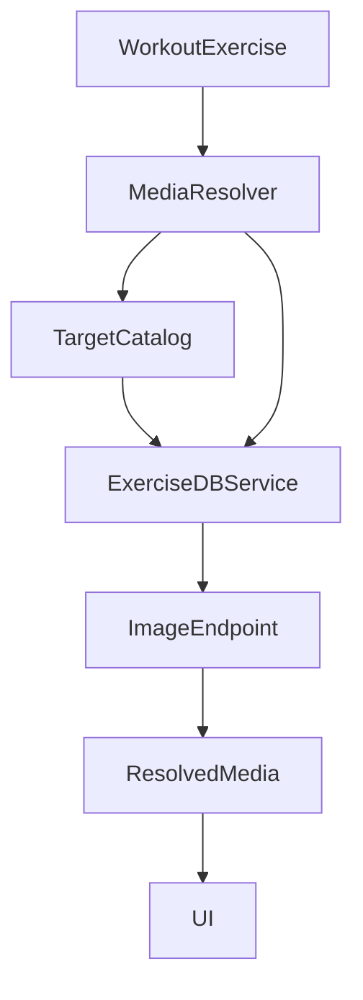

# Template de Especificação Técnica

## Resumo Executivo

Vamos melhorar a resolução de mídia (imagem/GIF) de exercícios via ExerciseDB (RapidAPI) com foco em **cobertura**: em vez de depender apenas de match por nome (“Lever Pec Deck Fly”), vamos priorizar um fluxo baseado em **target** (músculo-alvo) usando `GET /exercises/targetList` e `GET /exercises/target/{target}` para obter candidatos, ranqueá-los e persistir um mapeamento `localExerciseId -> exerciseDBId`. Com o `exerciseDBId` escolhido, a UI busca a imagem via `GET /image?resolution={...}&exerciseId={...}` respeitando o `MediaDisplayContext` (thumbnail/card/detail).

A implementação é incremental e compatível com o código atual (`ExerciseDBService`, `ExerciseMediaResolver`, DI em `AppContainer`). Mantemos fallback por nome quando target não for conhecido/valido ou quando a API não retornar candidatos.

## Arquitetura do Sistema

### Visão Geral dos Componentes

- **ExerciseDBService (Data/Services)**: cliente HTTP para endpoints do ExerciseDB (RapidAPI). Hoje suporta:
  - `GET /exercises/name/{name}`
  - `GET /exercises/exercise/{id}`
  - `GET /image?resolution=&exerciseId=`
  - Mudança: adicionar `GET /exercises/targetList` e `GET /exercises/target/{target}`.
- **ExerciseMediaResolver (Data/Services)**: resolve mídia para um `WorkoutExercise`:
  - usa cache em memória + mapeamento persistido em `UserDefaults`.
  - Mudança: resolver `exerciseId` preferindo fluxo por **target** + ranking determinístico.
- **ExerciseDBTargetCatalog (novo, Data/Services)**:
  - baixa e cacheia `targetList` com TTL (ex.: 7 dias), além de expor `isValidTarget(_:)`.
- **Domain models**:
  - `WorkoutExercise`: possui `name`, `mainMuscle`, `equipment`.
  - `MuscleGroup` e `EquipmentType` são usados para derivar target e rankear candidatos.
- **UI**:
  - `ExerciseMediaImage` consome `ResolvedExerciseMedia.preferredURL` e exibe placeholder quando necessário.

Fluxo de dados (alto nível):

## Design de Implementação

### Interfaces Principais

Atualizar o protocolo `ExerciseDBServicing` para incluir targets:

- `func fetchTargetList() async throws -> [String]`
- `func fetchExercises(target: String, limit: Int) async throws -> [ExerciseDBExercise]`

E criar um pequeno catálogo:

- `protocol ExerciseDBTargetCataloging: Sendable`
  - `func loadTargets(forceRefresh: Bool) async throws -> [String]`
  - `func isValidTarget(_ target: String) async -> Bool`

### Modelos de Dados

- `ExerciseDBExercise` (já existe) contém `id`, `name`, `target`, `equipment` etc.
- `ResolvedExerciseMedia` (já existe) mantém `imageURL/gifURL` e `source`.
- **Novo**: `ExerciseDBTargetCacheRecord`
  - `targets: [String]`
  - `fetchedAt: Date`
  - Persistido em `UserDefaults` sob uma chave dedicada (ex.: `exercisedb_target_list_v1`).

### Endpoints de API

- `GET /exercises/targetList`
  - Retorna lista de targets válidos (strings).
- `GET /exercises/target/{target}`
  - Retorna lista de exercícios cujo `target` == `{target}`.
- `GET /image?resolution={180|360|720}&exerciseId={id}`
  - Retorna URL JSON ou mídia; no app, tratamos ambos.

## Pontos de Integração

- **RapidAPI auth**: headers `x-rapidapi-key` e `x-rapidapi-host` (via `ExerciseDBConfiguration` com Keychain).
- **Timeouts**:
  - `targetList`: 10–15s (uma vez por TTL).
  - `target/{target}` e `/image`: 10–15s.
- **Cache**:
  - `targetList` cache persistido com TTL.
  - `localExerciseId -> exerciseDBId` persistido (já existe `exercisedb_id_mapping_v1`).
  - cache em memória por resolução (`resolvedCache`) já existe.

## Heurística de Resolução (cobertura primeiro)

Ordem de resolução de `exerciseDBId`:

1. **Mapping persistido** (UserDefaults) para `localExerciseId`.
2. Se `WorkoutExercise.id` já for numérico (parece ExerciseDB id), usar direto.
3. **Target-based**:
   - Derivar target a partir de `WorkoutExercise.mainMuscle` (ex.: `.biceps -> "biceps"`, `.chest -> "pectorals"` ou `"chest"`; a tabela final deve ser guiada pela `targetList`).
   - Validar se target existe em `targetList`. Se sim, buscar candidatos `GET /exercises/target/{target}`.
   - Rankear candidatos e escolher o melhor.
4. **Fallback por nome**:
   - Usar a estratégia atual por nome (com queries progressivas/normalização) via `GET /exercises/name/{name}`.

Ranking sugerido (determinístico):

- **Score de equipamento**: +3 se equipamento bater (mapeamento `EquipmentType -> ExerciseDB equipment string`), +1 se “similar”, 0 se desconhecido.
- **Score de nome**: número de tokens em comum (normalização e stopwords).
- Desempate: candidato com `name` mais curto (tende a ser mais “canonical”) ou primeiro da lista.

Observabilidade DEBUG:
- Logar: target derivado, se target era válido, quantidade de candidatos, top 3 scores, escolha final.

## Abordagem de Testes

### Testes Unitários

- Normalização de nome e tokenização:
  - “Lever Pec Deck Fly” deve gerar tokens compatíveis com “pec deck fly”.
- Ranking determinístico:
  - Dado um conjunto fixo de candidatos, deve selecionar sempre o mesmo.
- Derivação de target a partir de `MuscleGroup`.

### Testes de Integração/Smoke

- Com um stub/mocked `ExerciseDBServicing`, validar:
  - `resolveMedia(for:)` retorna `.exerciseDB` e uma URL quando houver candidatos.
  - fallback para placeholder quando não houver resultados/erros.

## Sequenciamento de Desenvolvimento

### Ordem de Construção

1. Adicionar endpoints `targetList` e `target/{target}` no `ExerciseDBService` + protocolo.
2. Criar `ExerciseDBTargetCatalog` com TTL e persistência.
3. Atualizar `ExerciseMediaResolver` para usar target-based primeiro (com ranking), mantendo fallback por nome.
4. Ajustar logs DEBUG e ferramentas de limpeza de cache (se necessário).
5. Adicionar testes unitários e smoke tests.

### Dependências Técnicas

- RapidAPI key configurada no Keychain (já suportado por `ExerciseDBConfiguration.loadFromUserKey()`).
- Disponibilidade do endpoint `/exercises/target/{target}` na RapidAPI ExerciseDB.

## Considerações Técnicas

### Decisões Principais

- Priorizar **cobertura** (não ficar sem mídia) sobre match “perfeito” de nome.
- Preferir target-based por ser menos sensível a variações de nome no catálogo local.
- Cache persistido para reduzir chamadas e evitar flutuação de resultados.

### Riscos Conhecidos

- Variação de nomenclatura de `target` entre `MuscleGroup` e ExerciseDB: mitigado validando com `targetList` e fallback por nome.
- Volume de candidatos por target pode ser grande: mitigar com `limit` e ranking local.
- Rate limiting/latência: mitigar com cache, prefetch controlado e timeouts.

### Requisitos Especiais

- Segurança: nenhuma chave em código; tudo via Keychain.
- Performance: cache em memória por resolução e TTL para targetList.

### Conformidade com Padrões

- Utilizar práticas de `@.cursor/skills/ios-development-skill/` (Swift Concurrency, DI via Swinject, separação Data/Domain/Presentation).
- Manter views reativas e não bloquear thread principal durante resolução de mídia.

### Arquivos relevantes

- `FitToday/FitToday/Data/Services/ExerciseDB/ExerciseDBService.swift`
- `FitToday/FitToday/Data/Services/ExerciseDB/ExerciseDBConfiguration.swift`
- `FitToday/FitToday/Data/Services/ExerciseDB/ExerciseMediaResolver.swift`
- `FitToday/FitToday/Presentation/DI/AppContainer.swift`
- `FitToday/FitToday/Presentation/DesignSystem/ExerciseMediaImage.swift`

