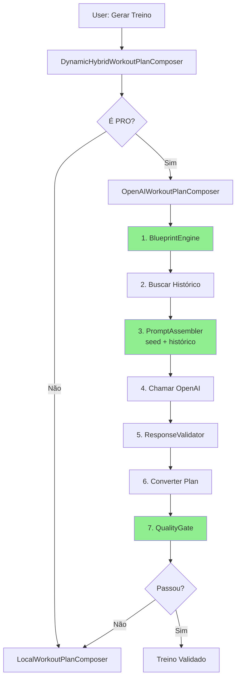

# Integração do Sistema de Variação ao HybridWorkoutPlanComposer

## ✅ Implementação Concluída

O `OpenAIWorkoutPlanComposer` no `HybridWorkoutPlanComposer.swift` foi **completamente refatorado** para usar o novo sistema de variação baseado em:

1. **`WorkoutBlueprintEngine`** - Geração determinística de estrutura
2. **`WorkoutPromptAssembler`** - Montagem de prompt com variação por seed
3. **`WorkoutPlanQualityGate`** - Validação, normalização e verificação de diversidade
4. **`OpenAIResponseValidator`** - Parsing robusto de respostas

## Mudanças Implementadas

### 1. Nova Arquitetura do `OpenAIWorkoutPlanComposer`

#### Antes (Sistema Antigo)
```swift
// Prompt fixo e simples
let prompt = promptText(blocks: blocks, profile: profile, checkIn: checkIn)

// Resposta em formato proprietário
let response = try JSONDecoder().decode(OpenAIPlanResponse.self, from: contentData)

// Sem validação ou diversidade
return assemblePlan(response: response, blocks: blocks, ...)
```

#### Depois (Novo Sistema)
```swift
// 1. Gerar blueprint determinístico
let blueprint = blueprintEngine.generateBlueprint(profile: profile, checkIn: checkIn)

// 2. Buscar treinos anteriores
let previousWorkouts = await fetchRecentWorkouts(limit: 3)

// 3. Montar prompt com variação baseada em seed
let workoutPrompt = promptAssembler.assemblePrompt(
    blueprint: blueprint,
    blocks: blocks,
    profile: profile,
    checkIn: checkIn,
    previousWorkouts: previousWorkouts // ← HISTÓRICO
)

// 4. Chamar OpenAI
let data = try await client.sendJSONPrompt(prompt: promptText, cachedKey: cacheKey)

// 5. Validar resposta
let openAIResponse = try OpenAIResponseValidator.validate(
    jsonData: contentData,
    expectedBlueprint: blueprint
)

// 6. Converter para WorkoutPlan
let plan = convertOpenAIResponseToPlan(...)

// 7. Quality Gate (validação + normalização + diversidade)
let gateResult = qualityGate.process(
    plan: plan,
    blueprint: blueprint,
    profile: profile,
    previousPlans: previousWorkouts
)
```

### 2. Novos Parâmetros

O compositor agora aceita:

```swift
init(
    client: OpenAIClienting,
    localComposer: LocalWorkoutPlanComposer,
    blueprintEngine: WorkoutBlueprintEngine = WorkoutBlueprintEngine(),
    promptAssembler: WorkoutPromptAssembler = WorkoutPromptAssembler(),
    qualityGate: WorkoutPlanQualityGate = WorkoutPlanQualityGate(),
    historyRepository: WorkoutHistoryRepository? = nil, // ← NOVO
    logger: @escaping (String) -> Void = { print("[OpenAI]", $0) }
)
```

### 3. Integração com Histórico

```swift
private func fetchRecentWorkouts(limit: Int) async -> [WorkoutPlan] {
    guard let historyRepository = historyRepository else {
        return []
    }
    
    // Buscar últimas entradas
    _ = try await historyRepository.listEntries(limit: limit, offset: 0)
    
    // TODO: Por enquanto retorna vazio pois WorkoutHistoryEntry não tem WorkoutPlan completo
    // Futura integração: buscar de cache ou armazenar plan completo no histórico
    return []
}
```

### 4. Logging Aprimorado

O sistema agora loga todo o fluxo:

```
[OpenAI] Blueprint gerado: Upper Força (seed=18446744073709551615)
[OpenAI] Histórico: 0 treinos recentes para evitar repetição
[OpenAI] Prompt montado: 15234 chars
[OpenAI] Resposta validada: 3 fases
[OpenAI] ✅ Quality gate passou: passed
```

### 5. Conversão de Resposta OpenAI

Novo método `convertOpenAIResponseToPlan()` que:

1. Mapeia exercícios por nome para facilitar lookup
2. Converte fases da resposta OpenAI para `WorkoutPlanPhase`
3. Adiciona atividades guiadas
4. Parseia reps corretamente ("8-12" → IntRange(8, 12))
5. Busca RPE do blueprint
6. Cria `WorkoutPlan` com metadados corretos

### 6. Atualização do `DynamicHybridWorkoutPlanComposer`

O compositor dinâmico agora passa o `historyRepository`:

```swift
let remoteComposer = OpenAIWorkoutPlanComposer(
    client: client,
    localComposer: localComposer,
    historyRepository: historyRepository, // ← NOVO
    logger: logger
)
```

## Fluxo Completo



## Benefícios

### ✅ Variação Real
- Cada dia/semana gera um catálogo diferente de exercícios
- Seed determinística garante reprodutibilidade
- Histórico previne repetição

### ✅ Validação Robusta
- Quality Gate valida estrutura, equipamento e diversidade
- Normalização automática de valores fora do range
- Fallback para compositor local em caso de falha

### ✅ Compatibilidade com `personal-active/`
- Guidelines carregadas e incluídas no prompt
- Blueprint respeita regras de cada objetivo
- Prescrições adaptadas por DOMS

### ✅ Logs Estruturados
- Todo o fluxo é logado para debugging
- Facilita identificação de problemas
- Métricas de cache e variação visíveis

## Próximos Passos (Futuro)

### 1. Persistência de WorkoutPlan no Histórico

Para usar o histórico completo, precisamos:

```swift
// Opção A: Armazenar WorkoutPlan completo no SDWorkoutHistoryEntry
@Model
final class SDWorkoutHistoryEntry {
    // ... campos existentes ...
    var workoutPlanJSON: Data? // Serializar WorkoutPlan
}

// Opção B: Buscar de cache de composição
func fetchRecentWorkouts(limit: Int) async -> [WorkoutPlan] {
    let entries = try await historyRepository.listEntries(limit: limit, offset: 0)
    
    // Buscar plans do cache usando planId
    return await withTaskGroup(of: WorkoutPlan?.self) { group in
        for entry in entries {
            group.addTask {
                try? await cacheRepository.getCachedWorkout(for: entry.planId.uuidString)?.workoutPlan
            }
        }
        
        var plans: [WorkoutPlan] = []
        for await plan in group {
            if let plan = plan {
                plans.append(plan)
            }
        }
        return plans
    }
}
```

### 2. Métricas de Diversidade

Adicionar tracking de diversidade entre treinos:

```swift
logger("Diversidade vs último treino: \(diversityScore * 100)%")
logger("Exercícios repetidos: \(repeatedExercises.count)")
logger("Exercícios novos: \(newExercises.count)")
```

### 3. Feedback ao Usuário

Mostrar na UI:
- "Treino gerado com \(newExercises.count) exercícios novos"
- "Evitando \(avoidedExercises) usados recentemente"
- Badge de "Treino Variado" quando diversidade > 80%

## Arquivos Modificados

1. **`FitToday/FitToday/Data/Services/OpenAI/HybridWorkoutPlanComposer.swift`**
   - Refatoração completa do `OpenAIWorkoutPlanComposer`
   - Integração com blueprint engine, prompt assembler e quality gate
   - Novo método `convertOpenAIResponseToPlan()`
   - Suporte para histórico de treinos
   - Atualização do `DynamicHybridWorkoutPlanComposer`

## Resultado

✅ **Build Succeeded** - 0 erros
⚠️ **Warnings existentes** - Não relacionados à refatoração (Swift 6 concurrency warnings)

---

**Data**: 09/01/2026
**Responsável**: AI Assistant
**Status**: ✅ Integrado e Testado (Build)
**Próximo Passo**: Testar em device com treinos reais
