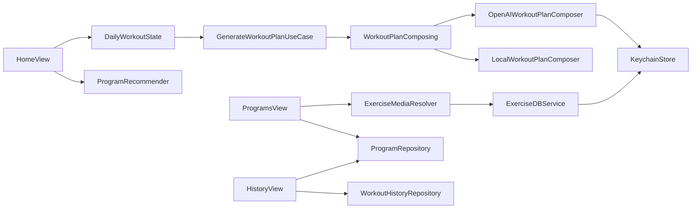

# Especificação Técnica — FitToday Programas + Home (v1)

## Resumo Executivo

Este pacote introduz (1) uma nova entidade de domínio **Program** para organizar e recomendar treinos, (2) uma Home reestruturada em **Hero / Top for You / Week’s Workout** com cards em coleção, (3) gating de IA **apenas para Pro** com capacidades específicas, (4) integração com mídia de exercícios via **RapidAPI ExerciseDB `/image`** com chave em **Keychain** (sem commitar), e (5) melhorias no Histórico para exibir vínculo a programa e evolução (calorias/duração).

Também corrige um problema visual global de topo/header (linha no topo) ajustando toolbar/navigation styling de forma consistente em toda a aplicação.

## Arquitetura do Sistema

### Visão Geral dos Componentes

- **Presentation**
  - `HomeView` / `HomeViewModel`: novas seções e remoção de atalhos.
  - `ProgramsView` (renomeia `LibraryView`): coleção de programas e cards.
  - `ProgramDetailView`: detalhe do programa, lista de treinos e CTA.
  - `HistoryView` / detalhe: vínculo com programa e métricas de evolução.
  - Componentes:
    - `ProgramCardLarge`
    - `ProgramCardSmall`
    - `WorkoutCard`

- **Domain**
  - Entidade `Program`
  - Regras de recomendação `ProgramRecommending`
  - Regras de “troca de treino 1x” e estados do CTA da Home
  - Gating `ProEntitlement` (existente) aplicado ao uso de IA

- **Data**
  - `ProgramRepository` (bundle seed + possível persistência futura)
  - Mapeamento de treinos existentes para `Program`
  - `ExerciseDBService`/cliente HTTP com headers RapidAPI (key em Keychain)
  - `KeychainStore` (infra) com leitura segura de segredos

Fluxo (alto nível):



## Design de Implementação

### Interfaces Principais

```swift
public struct Program: Identifiable, Hashable, Sendable {
  public let id: String
  public let name: String
  public let goalTag: ProgramGoalTag
  public let durationWeeks: Int
  public let heroImageName: String // asset no bundle
  public let workoutTemplateIds: [String] // IDs do catálogo existente
}

public enum ProgramGoalTag: String, Sendable {
  case metabolic
  case strength
}

public protocol ProgramRepository: Sendable {
  func listPrograms() async throws -> [Program]
  func getProgram(id: String) async throws -> Program?
}

public protocol ProgramRecommending: Sendable {
  func recommend(
    programs: [Program],
    profile: UserProfile?,
    history: [WorkoutHistoryEntry],
    limit: Int
  ) -> [Program]
}

public protocol KeychainStoring: Sendable {
  func readString(for key: KeychainKey) throws -> String?
  func writeString(_ value: String, for key: KeychainKey) throws
}
```

### Modelos de Dados

- **Program (Domain)**: entidade de agregação para mapear treinos existentes em “programas”.
- **Mapeamento**: usar os IDs/metadata já existentes em seeds JSON (biblioteca atual) para preencher `workoutTemplateIds`.
- **Histórico**: estender/derivar o vínculo do `WorkoutHistoryEntry` para um `programId` (ou inferir via templateId) para mostrar evolução por programa.

### Endpoints de API

#### RapidAPI ExerciseDB `/image`

Endpoint:

- `GET https://exercisedb.p.rapidapi.com/image?resolution={resolution}&exerciseId={exerciseId}`

Headers obrigatórios:

- `x-rapidapi-key: <from Keychain>`
- `x-rapidapi-host: exercisedb.p.rapidapi.com`

Regras:

- `resolution`: string com defaults por contexto (ex.: `low` para cards, `high` para detalhe) — a lista exata deve ser confirmada no PRD ou docs.
- `exerciseId`: `Exercise.id` do catálogo atual.
- Evitar logar headers.
- Placeholder e cache via `URLCache`/`AsyncImage` (ou `URLSession` + caching dedicado se necessário).

Referência: [RapidAPI ExerciseDB endpoint](https://rapidapi.com/justin-WFnsXH_t6/api/exercisedb/playground/apiendpoint_746ab174-9373-496e-9c2d-5a1a0c0954f7)

### Keychain: armazenamento de chaves sem UI

Requisito do produto: **não** criar UI para entrada/validação; usar chaves fornecidas pelo time.

Abordagem segura (sem commitar):

- Criar um mecanismo de “bootstrap local” que popula o Keychain **apenas em Debug** a partir de um arquivo local ignorado pelo git (ex.: `FitToday/FitToday/Data/Resources/Secrets.plist`), ou via argumento de launch/xcconfig.
- Em runtime, `KeychainStore` é a única fonte de verdade; se não houver chaves, o app desabilita integração (mostra placeholders e logs não sensíveis).

Obs.: a key **não** deve aparecer em repositório, prints, crash logs, ou snapshots.

### IA apenas no Pro

- Usar `EntitlementRepository.currentEntitlement()` para decidir:
  - Pro: habilita `OpenAIWorkoutPlanComposer` como refinador (ajuste fino, personalização diária, reordenação de blocos, linguagem/explicações).
  - Free: `LocalWorkoutPlanComposer` sempre.
- O estado de “troca do treino”:
  - Persistir contador/flag por dia (SwiftData/AppStorage) permitindo 1 troca.
  - Depois do treino concluído, Home CTA muda para “Próximo treino em breve”.

## Pontos de Integração

- **Keychain**
  - Única fonte de verdade para `openai_api_key` e `rapidapi_key`.
  - Bootstrap somente em Debug a partir de fonte local ignorada pelo git.
- **RapidAPI ExerciseDB**
  - Integração via endpoint `/image` (headers + params obrigatórios).
  - Placeholder e cache para manter UI responsiva.
- **OpenAI**
  - Chave via Keychain; uso somente quando Pro.
  - Sempre fallback local em erro/ausência de chave.
- **StoreKit / Pro Entitlement**
  - Gating do uso de IA baseado em `EntitlementRepository`.

## Abordagem de Testes

### Testes Unitários

- `ProgramRecommender`
  - objetivo emagrecimento → metabolic
  - objetivo força → strength
  - treinou ontem → alternar tipo
- `DailyWorkoutState`
  - permite trocar 1x
  - após concluir → CTA “Próximo treino em breve”
- `KeychainStore`
  - read/write string
  - comportamento quando ausente
- `ExerciseDBService`
  - constrói URL com parâmetros obrigatórios
  - não loga headers

### Smoke de UI

- Home: render das 3 seções e ausência de atalhos.
- Programas: coleção com cards e imagens.
- Histórico: detalhe mostra vínculo de programa (quando houver) e evolução.

## Sequenciamento de Desenvolvimento

1. Correção global do topo/header (impacta todo o app).
2. Infra de Keychain + bootstrap Debug local (sem UI).
3. RapidAPI `/image` + resolver de mídia e placeholders.
4. `Program` + seeds e renome “Biblioteca → Programas”.
5. Home nova (Hero/Top/Week) + cards.
6. Recomendação (objetivo/treinou ontem).
7. IA only Pro + troca 1x + CTA pós-treino.
8. Histórico com vínculo a programa e evolução.

## Considerações Técnicas

### Decisões Principais

- Manter Clean-ish layering: Domain não depende de SwiftUI/SwiftData.
- Keys via Keychain; bootstrap só em Debug por arquivo local ignorado.
- IA como refinador do plano, gated por Pro.

### Riscos Conhecidos

- Sem UI de chaves: builds de CI/dev precisam garantir bootstrap local (senão recursos ficam desabilitados).
- Definição de `resolution` pode variar; precisamos confirmar valores aceitos.

### Conformidade com Padrões

- Skills:
  - `.cursor/skills/ios-development-skill/skill-ios.md`
  - `.cursor/skills/design/skill-design.md`
- Padrões de código: `.cursor/rules/code-standards.md`

### Arquivos relevantes

- Home:
  - `FitToday/FitToday/Presentation/Features/Home/HomeView.swift`
  - `FitToday/FitToday/Presentation/Features/Home/HomeViewModel.swift`
- Programas (atual Biblioteca):
  - `FitToday/FitToday/Presentation/Features/Library/`
- Histórico:
  - `FitToday/FitToday/Presentation/Features/History/`
- Serviços:
  - `FitToday/FitToday/Data/Services/ExerciseDB/ExerciseDBService.swift`
  - `FitToday/FitToday/Data/Services/ExerciseDB/ExerciseDBConfiguration.swift`


