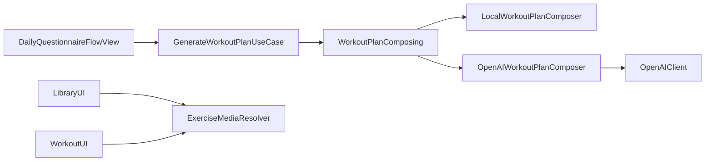

# Especificação Técnica — FitToday Workouts v2

## Resumo Executivo

O Workouts v2 introduz duas melhorias técnicas principais: (1) um resolver de mídia para exercícios baseado em `v2.exercisedb.io` (sem autenticação) com fallback e cache e (2) um upgrade do motor de geração de treinos para produzir planos mais completos e “de especialista”, guiados pelos perfis em `personal-active/` e usando o `OpenAIClient` existente para ajustes estruturados em JSON com fallback local.

A abordagem prioriza mudanças pequenas e seguras: manter a arquitetura em camadas (Domain/Data/Presentation), aplicar DI via Swinject, respeitar Swift Concurrency, e reforçar desempenho de SwiftUI (evitar churn de estado e carregar mídia com placeholders e tamanhos fixos).

## Arquitetura do Sistema

### Visão Geral dos Componentes

- **Presentation**
  - `LibraryView` / `LibraryDetailView`: listagem e detalhe de treinos Free e navegação até detalhe de exercício.
  - `WorkoutPlanView` / `WorkoutExerciseDetailView`: execução do treino gerado e detalhe do exercício.
  - `ExerciseDetailView` (novo ou adaptação de existente): UI unificada para mostrar execução (GIF/Imagem), instruções e prescrição.
- **Domain**
  - `WorkoutPlanComposing`: protocolo de composição.
  - Regras de qualidade/validação do plano (novo utilitário): garante “completude mínima”.
- **Data**
  - `ExerciseMediaResolver` (novo): resolve URLs de mídia e aplica fallback.
  - `OpenAIWorkoutPlanComposer` (existente): refinado para usar guias de `personal-active/` e schema JSON rígido.
  - `HybridWorkoutPlanComposer` (existente): garante fallback local e regras de uso.

Fluxo de dados (alto nível):



## Design de Implementação

### Interfaces Principais

Sugestão de interfaces (Swift) para isolar responsabilidades:

```swift
protocol ExerciseMediaResolving: Sendable {
  func resolvedMedia(for exerciseId: String, fallback: ExerciseMedia?) -> ExerciseMedia
}

protocol WorkoutPlanValidating: Sendable {
  func validate(plan: WorkoutPlan) throws
}
```

Responsabilidades:

- `ExerciseMediaResolving`: construir URLs `https://v2.exercisedb.io/image/{id}` e decidir prioridade (GIF -> imagem -> placeholder).
- `WorkoutPlanValidating`: aplicar regras mínimas de completude (quantidade de exercícios, presença de prescrição, descansos razoáveis, etc.).

### Modelos de Dados

Modelos já existentes:

- `WorkoutExercise` com `ExerciseMedia` (deve suportar `gifURL` e `imageURL`).
- `ExercisePrescription` com `sets`, `reps` e `restInterval`.
- `WorkoutPlan` com título, foco, intensidade e lista de exercícios.

Extensões/novidades propostas:

- **Media Resolver** não precisa alterar modelos; pode preencher URLs quando estiverem ausentes.
- **Perfis de especialista**: interpretar os arquivos em `personal-active/` como “guidelines”. No curto prazo, tratá-los como texto de referência para prompt; no médio prazo, extrair um DSL estruturado.

### Endpoints de API

- **ExerciseDB v2 (mídia)**:
  - `GET https://v2.exercisedb.io/image/{id}`
  - Uso: `AsyncImage(url:)` para carregar e cachear via `URLCache`.
  - Observação: a mesma URL pode servir como “gif” no contexto do app (quando for animada).

- **OpenAI (ajuste de plano)**:
  - Chamada encapsulada por `OpenAIClient.sendJSONPrompt(prompt:cachedKey:)`.
  - Resposta esperada: JSON (schema restrito) com IDs e parâmetros (sets/reps/rest/ordem).

## Pontos de Integração

- **ExerciseDB v2**:
  - Sem autenticação.
  - Tratamento de erro: placeholder + log.
  - Cache: `URLCache.shared` com política conservadora.

- **OpenAI**:
  - Chave via `OpenAIConfig.plist`.
  - Tratamento de erro: fallback local automático.
  - Custo: limitar tokens/temperatura e retornar JSON mínimo.

## Abordagem de Testes

### Testes Unitários

- `ExerciseMediaResolver`:
  - Resolve URL correta para `exerciseId`.
  - Usa fallback quando `exerciseId` vazio.
  - Mantém `gifURL` se já existir.
- `WorkoutPlanValidating`:
  - Rejeita plano com lista vazia.
  - Rejeita prescrição com sets/reps/rest inválidos.
- `OpenAIWorkoutPlanComposer`:
  - Com mock de `OpenAIClienting`, valida parsing de JSON e aplicação de ajustes.
  - Cenários de erro -> fallback local.

### Testes de UI (smoke)

- Biblioteca -> detalhe -> tocar exercício abre detalhe e mostra placeholder quando mídia falha.
- Home -> questionário -> treino -> tocar exercício abre detalhe.

## Sequenciamento de Desenvolvimento

### Ordem de Construção

1. **MediaResolver + cache/placeholder** (base para toda UI de exercícios).  
2. **Detalhe do exercício** (unificar experiência e validar mídia).  
3. **Upgrade do composer local com validação** (garantir “treino completo” mesmo sem OpenAI).  
4. **Refino do OpenAI composer** (schema rígido + guias `personal-active/`).  
5. **Ajustes de performance e testes**.

### Dependências Técnicas

- Disponibilidade do domínio `v2.exercisedb.io` para imagens/GIFs.
- `OpenAIConfig.plist` válido para quem estiver testando OpenAI.

## Considerações Técnicas

### Decisões Principais

- **Resolver de mídia** em vez de “hardcode no JSON”: centraliza regras, reduz inconsistência e permite fallback.
- **OpenAI como refinador** (não gerador do zero): reduz custo e risco; melhora qualidade sem inventar exercícios.
- **Validação pós-OpenAI**: evita planos inválidos/incompletos.

### Riscos Conhecidos

- GIF via `AsyncImage` pode não animar em todos os casos; pode ser necessário player dedicado (ex.: `WKWebView`).
- Catálogo local pode ter IDs que não existem na CDN `v2.exercisedb.io`; precisamos de fallback e métricas.
- Concurrency warnings em Swift 6 se atores e `@MainActor` não forem respeitados.

### Requisitos Especiais

- Performance:
  - Evitar trabalho pesado em `body` e listas.
  - Tamanhos fixos para mídia; placeholders; evitar re-layout.
  - Considerar downsampling se trocarmos `AsyncImage`.
- Segurança:
  - Não logar chave OpenAI.
  - Não persistir prompts com dados sensíveis.

### Conformidade com Padrões

Rules relevantes:

- `.cursor/rules/code-standards.md` (guia Kodeco Swift Style; sem emojis; golden path; clareza/consistência).

Skills a aplicar:

- `.cursor/skills/ios-development-skill/skill-ios.md` (Swift/SwiftUI, Clean Architecture).
- `.cursor/skills/swift-concurrency-expert/SKILL.md` (Swift 6 actor isolation, Sendable).
- `.cursor/skills/swiftui-performance-audit/SKILL.md` (perf de listas/imagens, invalidations).
- `.cursor/skills/design/skill-design.md` + DesignSystem em `FitToday/FitToday/Presentation/DesignSystem/`.

### Arquivos relevantes

- UI:
  - `FitToday/FitToday/Presentation/Features/Library/LibraryView.swift`
  - `FitToday/FitToday/Presentation/Features/Library/LibraryDetailView.swift`
  - `FitToday/FitToday/Presentation/Features/Workout/WorkoutPlanView.swift`
  - `FitToday/FitToday/Presentation/Features/Workout/WorkoutExerciseDetailView.swift`
- Data/Engine:
  - `FitToday/FitToday/Data/Services/OpenAI/OpenAIClient.swift`
  - `FitToday/FitToday/Data/Services/OpenAI/OpenAIWorkoutPlanComposer.swift`
  - `FitToday/FitToday/Data/Services/OpenAI/HybridWorkoutPlanComposer.swift`
  - `FitToday/FitToday/Domain/UseCases/LocalWorkoutPlanComposer.swift`
- Diretrizes:
  - `personal-active/performance.md`
  - `personal-active/força-pura.md`
  - `personal-active/emagrecimento.md`
  - `personal-active/condicionamento-fisico.md`


